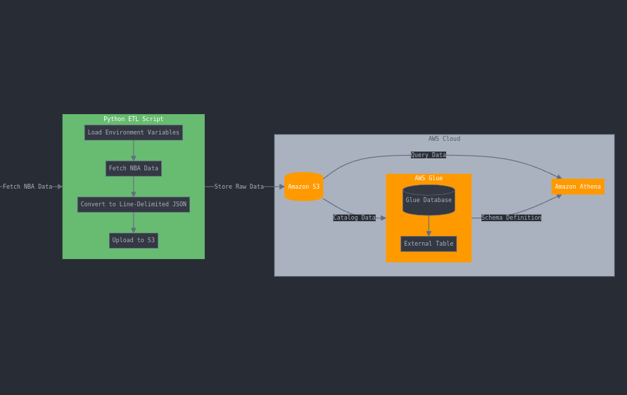
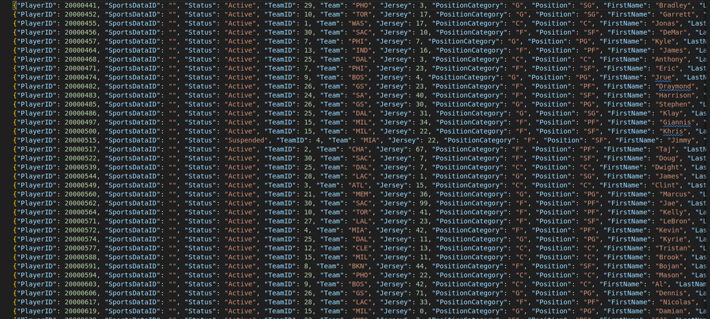

# 30 Days DevOps Challenge - NBA Data Lake
---

**Day 3:** Automating the building of an NBA Sports Data Lake by leveraging AWS S3, AWS Glue, and AWS Athena to set up an infrastructure to store and query NBA-related data.


## **Project Overview**
This **NBA data Lake** project does the following:
- Creates a Python script to automate the process of building the data lake.
- Creates an Amazon S3 bucket to store raw and processed data.
- Uploads sample NBA data (JSON format) to the S3 bucket.
- Creates an AWS Glue database and an external table for querying the data.
- Configures Amazon Athena for querying data stored in the S3 bucket.

---
## **Features**
- Creates a Python script to automate the process of building the data lake.
- Creates an Amazon S3 bucket to store raw and processed data.
- Uploads sample NBA data (JSON format) to the S3 bucket.
- Creates an AWS Glue database and an external table for querying the data.
- Configures Amazon Athena for querying data stored in the S3 bucket.


## **Prerequisites**
- Free account with subscription and API Key at [sportsdata.io](https://sportsdata.io/)
- Personal AWS account with basic understanding of AWS and Python
- IAM Role/Permissions have been set

---

## **Technical Architecture**


---

## **Technologies Used**
- **Cloud Provider**: AWS
- **Core Services**: AWS S3, AWS Glue, AWS Athena
- **External API**: NBA Game API (SportsData.io)
- **Programming Language**: Python3

---


## **Project File Structure**
```bash
Sports-Data-Lake-AWS/
├── src/
│   ├── nba_data_lake.py          # Main function code
├── policies/
│   ├── IAM_Role.json           # Permissions for running the script
├── .gitignore
├── README.md                        # Project documentation
├── delete_resources.py              # Python script for deleting all resources
└── requirements.txt 
```


## **Setup Instructions**

### 1. **Clone the Repository**
```bash
git clone https://github.com/BrianWangila/Sports-Data-Lake-AWS.git # Using HTTPS

# OR

git clone git@github.com:BrianWangila/Sports-Data-Lake-AWS.git    # Using SSH

cd Sports-Data-Lake-AWS

```

### 2. **To run the script**
1. Ensure you have logged into your AWS account and taken note of the Access key and secret key
2. Save them credentials in the .env file abut make sure you don't commit the file to an online repository
3. Install the required packages by running `pip install -r requirements.txt`
4. Run the script using `python3 src/nba_data_lake.py`

- You should see the resources were successfully created, the sample data was uploaded successfully and the Data Lake Setup Completed

### 3. **Manually check for the created resources**
- Go to the AWS Management Console and navigate to the respective services to verify the resources were created successfully
- You can also check the AWS CloudWatch logs for any errors
- You can check the AWS S3 bucket to verify the data was uploaded successfully
- You can check the AWS Glue Data Catalog to verify the database and table were created successfully
- You can check the AWS Athena to verify the database and table were created successfully. To do this, head over to Amazon Athena and paste the following sample query:
```bash
  SELECT FirstName, LastName, Position, Team
  FROM nba_players
  WHERE Position = 'PG';

  # Click Run -You should see an output if you scroll down under "Query Results"
```


### 4. **Cleaning up**
- Run the `delete_resources.py` script to delete all the resources created by the script. Run `python3 delete_resources.py`
- All your initially created resources will be deleted and you won't incur any charges in AWS


## **Output**



## **What We Learn**
1. Securing AWS services with least privilege IAM policies.
2. Automating the creation of services with a script.
3. Integrating external APIs into cloud-based workflows.


## **Future Enhancements**
1. Automate data ingestion with AWS Lambda
2. Implement a data transformation layer with AWS Glue ETL
3. Add advanced analytics and visualizations (AWS QuickSight)

